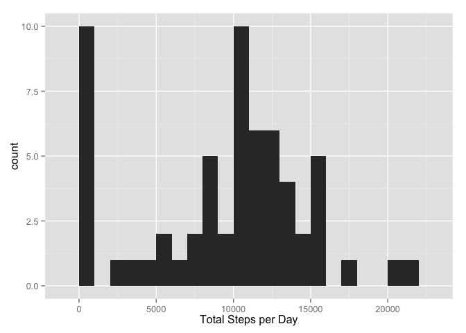
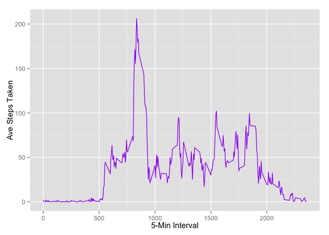
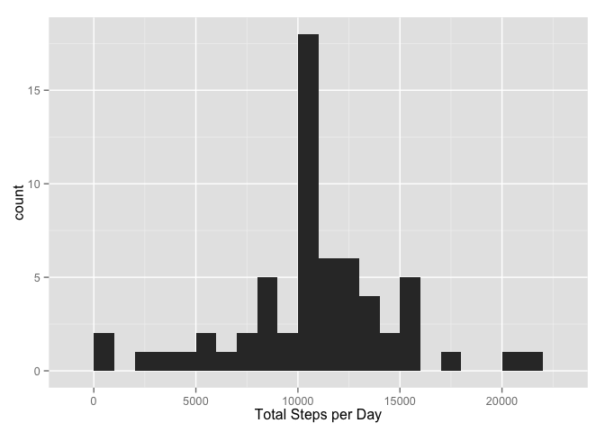
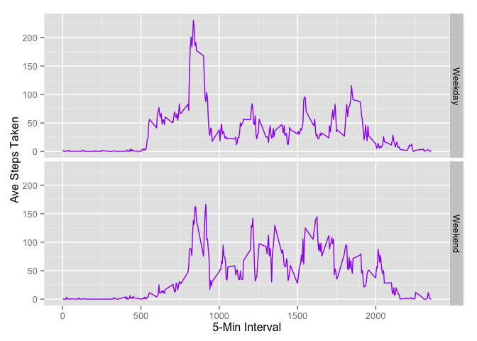

# Reproducible Research Peer Assessment 1
Art Webb  
May 15, 2015  

### Set working directory, download and unzip data


```r
setwd("~/OneDrive/Documents/R/Reproducible Research/Peer Assessment 1")

download.file(url="https://d396qusza40orc.cloudfront.net/repdata%2Fdata%2Factivity.zip", destfile="repdata-data-activity.zip", method="curl")

unzip(zipfile="~/OneDrive/Documents/R/Reproducible Research/Peer Assessment 1/repdata-data-activity.zip")
```

### What is mean total number of steps taken per day?

```r
#Load The Data
data <- read.csv("~/OneDrive/Documents/R/Reproducible Research/Peer Assessment 1/activity.csv")
#Load ggplot2
library(ggplot2)
```

```
## Warning: package 'ggplot2' was built under R version 3.1.3
```

```r
# Get total steps by day
totalSteps <- tapply(data$steps, data$date, FUN=sum, na.rm=TRUE)
qplot(totalSteps, binwidth=1000, xlab="Total Steps per Day")
```

 

```r
# Calculate and report the mean and median of the total number of steps taken per day
mean(totalSteps, na.rm=TRUE)
```

```
## [1] 9354
```

```r
median(totalSteps, na.rm=TRUE)
```

```
## [1] 10395
```

### What is the average daily activity pattern?

```r
# Make a time series plot of the 5-minute interval (x-axis) and the average number of steps taken, averaged across all days (y-axis)
averageSteps <- aggregate(x=list(steps=data$steps), by=list(interval=data$interval),
                      FUN=mean, na.rm=TRUE)
ggplot(data=averageSteps, aes(x=interval, y=steps)) +
  geom_line(color="purple") +
  xlab("5-Min Interval") +
  ylab("Ave Steps Taken")
```

 

```r
# Which 5-minute interval, on average across all the days in the dataset, contains the maximum number of steps?
averageSteps[which.max(averageSteps$steps),]
```

```
##     interval steps
## 104      835 206.2
```

### Imputing missing values

```r
# Calculate and report the total number of missing values in the dataset 
missingValues <- is.na(data$steps)
# How many missing
table(missingValues)
```

```
## missingValues
## FALSE  TRUE 
## 15264  2304
```

```r
# Replace each missing value with the mean value of its 5-minute interval
replaceValue <- function(steps, interval) {
  replace <- NA
  if (!is.na(steps))
    replace <- c(steps)
  else
    replace <- (averageSteps[averageSteps$interval==interval, "steps"])
  return(replace)
}
replaceData <- data
replaceData$steps <- mapply(replaceValue, replaceData$steps, replaceData$interval)

head(replaceData)
```

```
##     steps       date interval
## 1 1.71698 2012-10-01        0
## 2 0.33962 2012-10-01        5
## 3 0.13208 2012-10-01       10
## 4 0.15094 2012-10-01       15
## 5 0.07547 2012-10-01       20
## 6 2.09434 2012-10-01       25
```

```r
totalSteps <- tapply(replaceData$steps, replaceData$date, FUN=sum)
qplot(totalSteps, binwidth=1000, xlab="Total Steps per Day")
```

 

```r
mean(totalSteps)
```

```
## [1] 10766
```

```r
median(totalSteps)
```

```
## [1] 10766
```

### Are there differences in activity patterns between weekdays and weekends?


```r
# Create a new factor variable in the dataset with two levels – “weekday” and “weekend” indicating whether a given date is a weekday or weekend day.
replaceData$date <- as.Date(replaceData$date)
replaceData$day <- factor(format(replaceData$date, "%A"))
levels(replaceData$day)
```

```
## [1] "Friday"    "Monday"    "Saturday"  "Sunday"    "Thursday"  "Tuesday"  
## [7] "Wednesday"
```

```r
levels(replaceData$day) <- list(Weekday = c("Monday", "Tuesday", "Wednesday", "Thursday", "Friday"), Weekend = c("Saturday", "Sunday"))
levels(replaceData$day)
```

```
## [1] "Weekday" "Weekend"
```

```r
table(replaceData$day)
```

```
## 
## Weekday Weekend 
##   12960    4608
```

```r
# Make a panel plot containing a time series plot (i.e. type = "l") of the 5-minute interval (x-axis) and the average number of steps taken, averaged across all weekday days or weekend days (y-axis)
averageSteps <- aggregate(steps ~ interval + day, data=replaceData, mean)
ggplot(averageSteps, aes(interval, steps)) + geom_line(color="purple") + facet_grid(day ~ .) +
  xlab("5-Min Interval") + ylab("Ave Steps Taken")
```

 
