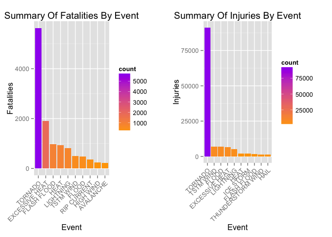
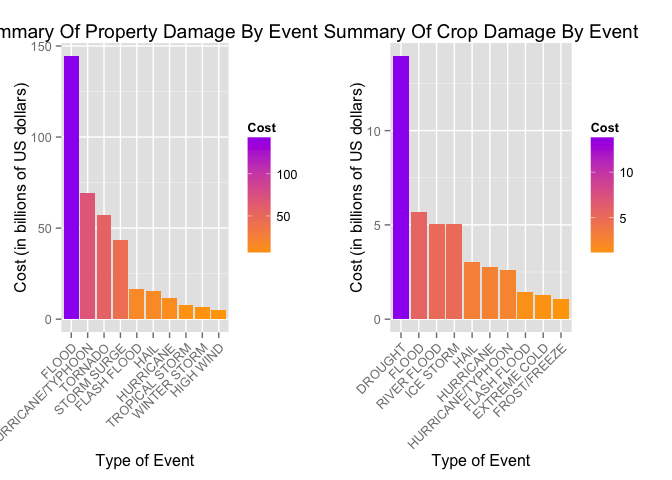

# Analysis Of NOAA Storm Data - Event Impact
Art Webb  
May 23, 2015  
## Synopsis

The following analysis involves exploration of the U.S. National Oceanic and Atmospheric Administration's storm data, from 1950 through 2011. Documentation for this data can be found at https://d396qusza40orc.cloudfront.net/repdata%2Fpeer2_doc%2Fpd01016005curr.pdf and an FAQ at https://d396qusza40orc.cloudfront.net/repdata%2Fpeer2_doc%2FNCDC%20Storm%20Events-FAQ%20Page.pdf.

### Analysis was preformed to answer the following questions:

1. Across the United States, which types of events (as indicated in the EVTYPE variable) are most harmful with respect to population health?

2. Across the United States, which types of events have the greatest economic consequences?

### After processing, cleaning and exploration, the following insights were gleaned:

1. Tornados are the most harmful events, with respect to population and health, acounting for 5633 fatalities and 91346 injuries across the measured data.

2. Events with the greatest economic consequences are floods, accounting for $144 Billion dollars in damage across the measured data.

## Data Processing

A check is made to see if the data has been downloaded. If not, the data is downloaded and saved into the working directory, read into R and date-stamped.


```r
# Check if dataset already exists
if (!file.exists("StormData.csv.bz2")) {
    fileURL <- 'https://d396qusza40orc.cloudfront.net/repdata%2Fdata%2FStormData.csv.bz2'
    download.file(fileURL, destfile='StormData.csv.bz2', method = 'curl')
}

# Read data
NOAAData <- read.csv(bzfile("StormData.csv.bz2"))

# Record date of download
dateOfDownload <- date()
```

`dplyr`, `ggplot2` and `gridExtra` libraries are loaded, fatalities and injuries, based on the type of event, are counted, arranged and stored into data frames. Visualizations are summarized using the top 10 results.


```r
#Load dplyr, ggplot2 and gridExtra
library(dplyr)
```

```
## 
## Attaching package: 'dplyr'
## 
## The following object is masked from 'package:stats':
## 
##     filter
## 
## The following objects are masked from 'package:base':
## 
##     intersect, setdiff, setequal, union
```

```r
library(ggplot2)
```

```
## Warning: package 'ggplot2' was built under R version 3.1.3
```

```r
library(gridExtra)
```

```
## Loading required package: grid
```

```r
#Summarize fatalies by events
fatalities <- NOAAData %>%
    group_by(EVTYPE) %>%
    summarise(count = sum(FATALITIES)) %>%
    arrange(desc(count))
fatalities <- fatalities[1:10, ]

#Summarize injuries by events
injuries <- NOAAData %>%
    group_by(EVTYPE) %>%
    summarise(count = sum(INJURIES)) %>%
    arrange(desc(count))
injuries <- injuries[1:10, ]
```

**PROPDMG** (property damage), **PROPDMGEXP** (property damage exponential), **CROPDMG** (crop damage) and **CROPDMGEXP** (crop damage exponential) require additional processing for analysis, as **PROPDMGEXP** and **CROPDMGEXP** contain the number of zeros that follow the quantities stored in the variables **PROPDMG** and **CROPDMG**. The processed variables are then stored into summary variables, **COST.PROP.DAMAGE** and **COST.CROP.DAMAGE**


```r
# Set exponential variables to zero
variableProcessing <- vector(mode = "numeric", length = dim(NOAAData)[1])

# Pattern check and value assignment
variableProcessing[NOAAData$PROPDMGEXP == "1"] <- 1
variableProcessing[NOAAData$PROPDMGEXP == "H" | NOAAData$PROPDMGEXP == "h" | NOAAData$PROPDMGEXP == "2"] <- 2
variableProcessing[NOAAData$PROPDMGEXP == "K" | NOAAData$PROPDMGEXP == "k" | NOAAData$PROPDMGEXP == "3"] <- 3
variableProcessing[NOAAData$PROPDMGEXP == "4"] <- 4
variableProcessing[NOAAData$PROPDMGEXP == "5"] <- 5
variableProcessing[NOAAData$PROPDMGEXP == "M" | NOAAData$PROPDMGEXP == "m" | NOAAData$PROPDMGEXP == "6"] <- 6
variableProcessing[NOAAData$PROPDMGEXP == "7"] <- 7
variableProcessing[NOAAData$PROPDMGEXP == "8"] <- 8
variableProcessing[NOAAData$PROPDMGEXP == "B" | NOAAData$PROPDMGEXP == "b"] <- 9
NOAAData <- NOAAData %>%
    mutate(COST.PROP.DAMAGE = PROPDMG * 10 ^ variableProcessing)
```


```r
# Set exponential variables to zero
variableProcessing <- vector(mode = "numeric", length = dim(NOAAData)[1])

# Pattern check and value assignment
variableProcessing[NOAAData$CROPDMGEXP == "1"] <- 1
variableProcessing[NOAAData$CROPDMGEXP == "H" | NOAAData$CROPDMGEXP == "h" | NOAAData$CROPDMGEXP == "2"] <- 2
variableProcessing[NOAAData$CROPDMGEXP == "K" | NOAAData$CROPDMGEXP == "k" | NOAAData$CROPDMGEXP == "3"] <- 3
variableProcessing[NOAAData$CROPDMGEXP == "4"] <- 4
variableProcessing[NOAAData$CROPDMGEXP == "5"] <- 5
variableProcessing[NOAAData$CROPDMGEXP == "M" | NOAAData$CROPDMGEXP == "m" | NOAAData$CROPDMGEXP == "6"] <- 6
variableProcessing[NOAAData$CROPDMGEXP == "7"] <- 7
variableProcessing[NOAAData$CROPDMGEXP == "8"] <- 8
variableProcessing[NOAAData$CROPDMGEXP == "B" | NOAAData$CROPDMGEXP == "b"] <- 9
NOAAData <- NOAAData %>%
    mutate(COST.CROP.DAMAGE = CROPDMG * 10 ^ variableProcessing)
```

**COST.PROP.DAMAGE** and **COST.CROP.DAMAGE** are built into data frames and summarized by the top 10 results.


```r
#Summarize property damage in a data frame
costPropDamage <- NOAAData %>% 
    count(EVTYPE, wt = COST.PROP.DAMAGE, sort = TRUE) %>% 
    slice(1:10) %>%
    mutate(n = n / 1e9)
names(costPropDamage) <- c("EVTYPE", "Cost")

#Summarize property damage in a data frame
costCropDamage <- NOAAData %>% 
    count(EVTYPE, wt = COST.CROP.DAMAGE, sort = TRUE) %>% 
    slice(1:10) %>%
    mutate(n = n / 1e9)
names(costCropDamage) <- c("EVTYPE", "Cost")
```

## Results

### Across the United States, which types of events (as indicated in the EVTYPE variable) are most harmful with respect to population health?

Histograms are construced, which highlight **Tornadoes** as being the primary cause of injuries and fatailties, with 5633 and 91346 respectively.


```r
#Construct histogram of fatalities by event
fatalitiesHist <- ggplot(data = fatalities, aes(x = reorder(EVTYPE, rev(count)), y = count)) + 
    geom_bar(stat = "identity", aes(fill = count)) +
    scale_fill_continuous(low = "orange", high = "purple") +
    theme(axis.text.x = element_text(angle = 45, hjust = 1)) +
    ylab("Fatalities") +
    xlab("Event") +
    ggtitle("Summary Of Fatalities By Event")

#Construct histogram of injuries by event
injuriesHist <- ggplot(data = injuries, aes(x = reorder(EVTYPE, rev(count)), y = count)) + 
    geom_bar(stat = "identity", aes(fill = count)) +
    scale_fill_continuous(low = "orange", high = "purple") +
    theme(axis.text.x = element_text(angle = 45, hjust = 1)) +
    ylab("Injuries") +
    xlab("Event") +
    ggtitle("Summary Of Injuries By Event")

#Arrange and print histograms
grid.arrange(fatalitiesHist, injuriesHist, ncol = 2)
```

 

### Across the United States, which types of events have the greatest economic consequences?

Histograms are construced, which highlight **Floods** as being the primary cause of property damage, costing upwards of $144 billion dollars. Of note, **Drought** has also had a significant economic impact on crops, costing approximately $14 billion dollars.


```r
#Construct histogram of property damage by event
propHist <- ggplot(data = costPropDamage, aes(x = reorder(EVTYPE, rev(Cost)), y = Cost)) + 
    geom_bar(stat = "identity", aes(fill = Cost)) +
    scale_fill_continuous(low = "orange", high = "purple") +
    theme(axis.text.x = element_text(angle = 45, hjust = 1)) +
    ylab("Cost (in billions of US dollars)") +
    xlab("Type of Event") +
    ggtitle("Summary Of Property Damage By Event")

#Construct histogram of crop damage by event
cropHist <- ggplot(data = costCropDamage, aes(x = reorder(EVTYPE, rev(Cost)), y = Cost)) + 
    geom_bar(stat = "identity", aes(fill = Cost)) +
    scale_fill_continuous(low = "orange", high = "purple") +
    theme(axis.text.x = element_text(angle = 45, hjust = 1)) +
    ylab("Cost (in billions of US dollars)") +
    xlab("Type of Event") +
    ggtitle("Summary Of Crop Damage By Event")

#Arrange and print histograms
grid.arrange(propHist, cropHist, ncol = 2)
```

 
